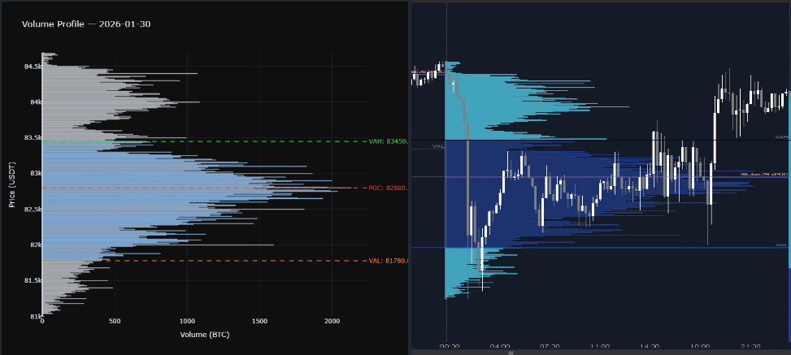

# Volume Profile Predictive Model

An ML pipeline that uses **Volume Profile** — a market microstructure tool used by institutional traders — to predict next-session price behavior on Bitcoin futures. Built from scratch in Python using 3 years of real market data.

`Python` · `pandas` · `NumPy` · `scikit-learn` · `Plotly` · `Binance API`

---



---

## What This Project Does

1. **Fetches** 1.6 million 1-minute candles from Binance's public API (no key required)
2. **Builds** a daily Volume Profile for each session — POC, VAH, VAL, value area width, delta, buy ratio
3. **Engineers** 15 ML features from the previous day's profile to predict today's price action
4. **Trains** a logistic regression model that achieves **84% accuracy** and **0.937 AUC** on 1,126 days of unseen data
5. **Backtests** three trading strategies with realistic fees, slippage, and position sizing across multiple market regimes

The strongest predictor is `price_vs_prev_poc` — whether today's price sits above or below yesterday's Point of Control. That single feature carries a coefficient of +3.06 in the model.

---

## Model Performance

Trained and evaluated on 1,126 trading days (January 2023 → January 2026), spanning a bear market recovery, the 2024 halving rally, and the 2025-2026 continuation.

| Metric | Value |
|---|---|
| Accuracy | 84% |
| Baseline (majority class) | 70.5% |
| Improvement over baseline | +13.5% |
| AUC | 0.937 |


---

## Backtest Results

The backtester simulates three strategies with realistic Binance futures costs: 0.02% maker fee, 0.05% taker fee, $10 slippage per side, 3% risk per trade, 3x leverage cap, and a minimum 1.5 R:R filter.

| Strategy | Trades | Win Rate | Gross P&L | Fees | Net P&L | Return | Sharpe |
|---|---|---|---|---|---|---|---|
| POC Bullish | 219 | 27.9% | +$11,173 | -$9,143 | +$2,030 | +20.3% | 0.62 |
| POC Bearish | 158 | 25.9% | +$8,796 | -$6,458 | +$2,338 | +23.4% | 0.70 |
| VAH Long | 211 | 19.0% | +$3,453 | -$7,495 | -$4,042 | -40.4% | -2.22 |
| Buy & Hold | — | — | — | — | +$40,686 | +406.9% | — |

The POC Bullish and POC Bearish strategies are net profitable after realistic costs. None beat buy-and-hold — but BTC went from $16k to $96k over this period. No active day trading strategy paying round-trip fees is going to outperform a 6x bull run. The more relevant question is whether the edge survives in a sideways or bearish regime, and that requires further testing.

The backtest's main finding: **transaction costs are the biggest enemy at this trade frequency.** All three strategies show positive gross edge, but fees eat most of it. The next step is reducing trade frequency with stricter signal filters rather than taking every setup.

---

## Project Structure

```
├── src/
│   ├── config.py                 # Centralized paths
│   ├── main.py                   # Pipeline orchestrator
│   ├── data/
│   │   ├── api_loader.py         # Fetches 1-min klines from Binance API
│   │   └── volume_profile.py     # Builds daily VP, computes POC/VAH/VAL
│   ├── features/
│   │   ├── features.py           # Extracts ML features from VP levels
│   │   └── labels.py             # Creates binary labels for supervised learning
│   ├── model/
│   │   ├── model.py              # Trains and saves the ML model
│   │   └── evaluation.py         # Measures predictive edge (ROC, AUC)
│   ├── backtest/
│   │   └── backtest.py           # Simulates trading strategies with realistic costs
│   └── viz/
│       └── visualize.py          # Plots VP for sanity checking
├── data/                         # Generated CSVs and model artifacts (gitignored)
├── assets/                       # Images for documentation
├── requirements.txt
├── CHANGELOG.md
└── README.md
```

### Setup

```bash
python -m venv .venv

# Windows
.venv\Scripts\activate

# macOS / Linux
source .venv/bin/activate

pip install -r requirements.txt
```

### Running the pipeline

```bash
# Full pipeline — fetches 3 years of klines (~10 min), then builds everything
python -m src.main

# Skip the API fetch if you already have the kline CSVs
python -m src.main --skip-fetch

# Run backtest separately
python -m src.backtest.backtest
```

---

## How It Works

### Data

The pipeline hits Binance's public futures endpoint (`/fapi/v1/klines`) and handles pagination automatically — Binance returns max 1,000 candles per request, so the loader loops and stitches them together. Three years of 1-minute data downloads in about 10 minutes. No API key, no DuckDB, no manual downloads.

### Volume Profile

Each day's 1-minute candles are aggregated into $10 price buckets. The engine computes the POC (highest-volume bucket), then expands outward until 70% of total volume is captured — defining the Value Area (VAH at the top, VAL at the bottom). The generated profiles were validated against the professional charting platform ATAS, producing nearly identical results.

### Feature Engineering

Yesterday's Volume Profile becomes today's input. The pipeline shifts all VP metrics by one day and computes 15 features including value area width, POC position, delta (net buying pressure), buy ratio, day type classification (accumulation / distribution / trending / neutral), and price distance to previous key levels.

### Backtester

Entry on first 15-minute candle touching the previous session's POC. Stop loss at the nearest Low Volume Node (LVN) detected from the previous day's profile. Take profit at the previous VAH (longs) or VAL (shorts). Trades are skipped if the risk-reward ratio falls below 1.5.

---

## Future Work

1. **Stricter signal filters** — reduce trade frequency to cut fee drag
2. **Walk-forward validation** — replace the static 80/20 split with a rolling window
3. **Power BI dashboard** — visualize equity curves and strategy comparison
4. **Trend day detection** — separate entry logic for directional days that never revisit the POC
5. **Naked POC tracking** — unvisited POCs from prior sessions as additional features
6. **Ensemble models** — test Random Forest and XGBoost against the logistic regression baseline
7. **Live signal generator** — Binance WebSocket for real-time end-of-day signals

---

## Version History

This is **v2**. The original pipeline (v1) used 6 months of raw tick data loaded via DuckDB. v2 replaced that with the API-based approach, expanded to 3 years, and added the backtester. The model accuracy held at 84% across both versions.

v1 is preserved at tag [`v1.0-tick-data`](../../tree/v1.0-tick-data). See [CHANGELOG.md](CHANGELOG.md) for full details.
