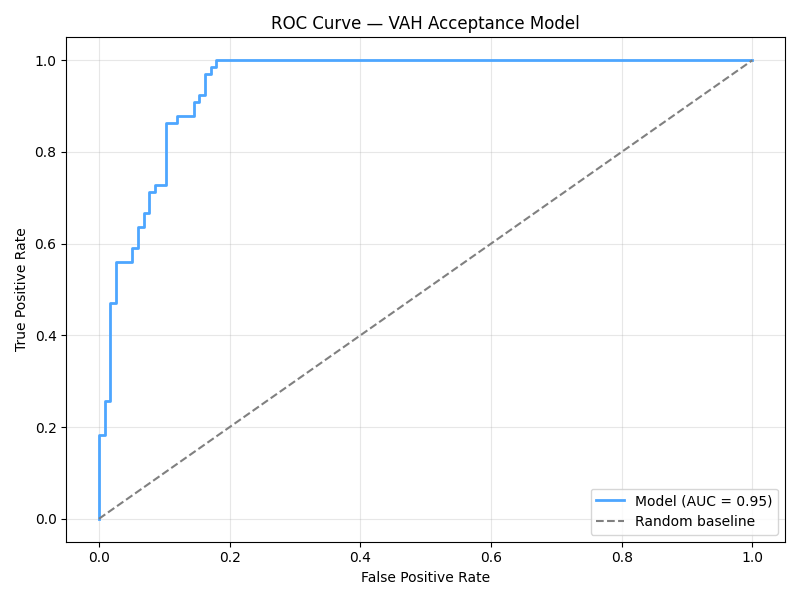

# Volume Profile Predictive Model

## 📌 Overview

This project was developed as the final project for one of the subjets in my Level 5 Data Science and Information Management course.

The objective is to explore whether **Volume Profile**, a market microstructure concept widely used in professional trading, contains predictive information that can be leveraged by machine learning.

Rather than relying on existing trading libraries, the project implements a complete Volume Profile engine in Python using raw Bitcoin futures tick data. The extracted market structure is then transformed into machine learning features to predict future price behavior.

The project combines concepts from:

- Data Engineering
- Financial Data Analysis
- Feature Engineering
- Machine Learning
- Quantitative Finance

---

## 📈 Results

| Metric | Value |
|----------|-------:|
| Accuracy | **84%** |
| Baseline Accuracy | **63.9%** |
| Improvement | **+20.1%** |
| AUC Score | **0.947** |

The model successfully outperformed the majority-class baseline, suggesting that Volume Profile contains useful predictive information for the selected trading setup.

---

## 🏗 Project Architecture

```text
Raw Binance Tick Data
        │
        ▼
 DuckDB Data Loader
        │
        ▼
 Volume Profile Engine
        │
        ▼
 Feature Engineering
        │
        ▼
 Label Generation
        │
        ▼
 Logistic Regression Model
        │
        ▼
 Evaluation
```


---

# 📂 Project Structure

| Module | Purpose |
|---------|---------|
| `data_loader.py` | Imports raw Binance tick data into DuckDB for efficient processing |
| `volume_profile.py` | Builds the daily Volume Profile and computes POC, VAH and VAL |
| `visualize.py` | Validates the generated Volume Profile against professional charting software |
| `features.py` | Generates machine learning features from Volume Profile levels |
| `labels.py` | Creates supervised learning labels |
| `model.py` | Trains and evaluates the predictive model |
| `evaluation.py` | Produces performance metrics, ROC curve and feature importance |
| `main.py` | Executes the complete pipeline |

---

# ⚙️ Pipeline

## 1. Data Loading

Raw BTCUSDT perpetual futures tick data was downloaded from Binance and imported into **DuckDB**.

Using DuckDB allows the project to process tens of millions of trades without loading the entire dataset into memory, making the pipeline significantly more memory efficient than a pure pandas workflow.

---

## 2. Volume Profile Engine

The core of the project recreates a Volume Profile directly from raw tick data.

For each trading session the engine computes:

- Point of Control (POC)
- Value Area High (VAH)
- Value Area Low (VAL)

using the standard **70% Value Area methodology**.

The generated profiles were validated against the professional charting platform **ATAS**, producing nearly identical results.

<p align="center">
 
</p>

---

## 3. Feature Engineering

The Volume Profile levels are transformed into structured numerical features suitable for machine learning.

Examples include:

| Feature | Description |
|----------|-------------|
| Previous POC | Yesterday's Point of Control |
| Previous VAH | Yesterday's Value Area High |
| Previous VAL | Yesterday's Value Area Low |
| Value Area Width | Width of the previous day's value area |
| Total Volume | Previous session volume |
| Delta | Net buying vs selling pressure |
| Buy Ratio | Percentage of aggressive buying |
| POC Position | Position of the POC inside the Value Area |
| Market Structure | Accumulation, Distribution, Trending or Neutral |

---

## 4. Label Generation

The first predictive task focuses on a simple binary classification problem:

> **Will today's closing price finish above yesterday's Value Area High?**

Additional labels were also generated for bullish and bearish Point of Control acceptance.

---

## 5. Model Training

The first implementation uses **Logistic Regression** as a baseline model.

Training pipeline:

- 80/20 Train-Test split
- StandardScaler feature normalization
- Logistic Regression classifier
- Performance evaluation on unseen data

---

## 6. Evaluation

The trained model was evaluated using multiple metrics including:

- Accuracy
- Precision
- Recall
- F1 Score
- ROC Curve
- AUC Score

The resulting **0.947 AUC** demonstrates strong discriminatory power while maintaining a substantial improvement over the baseline classifier.



---

# 🛠 Technologies

- Python
- Pandas
- NumPy
- DuckDB
- Plotly
- Scikit-learn
- Binance Historical Data

---

# 🚀 Future Improvements

Planned future work includes:

- Interactive backtesting dashboard
- Naked POC tracking
- Additional prediction labels
- XGBoost and Gradient Boosting models
- Tick-level precision improvements
- Live Binance API integration
- Automated signal generation
- Strategy execution and performance monitoring

---

# 🚀 Getting Started

Clone the repository:

```bash
git clone https://github.com/yourusername/VolumeProfilePredictiveModel.git
```

Install dependencies:

```bash
pip install -r requirements.txt
```

Run the complete pipeline:

```bash
python main.py
```

---

# 📚 References

- Binance Historical Market Data
- ATAS Trading Platform
- Volume Profile / Market Profile methodology

---

# 📄 License

This project is licensed under the MIT License.


